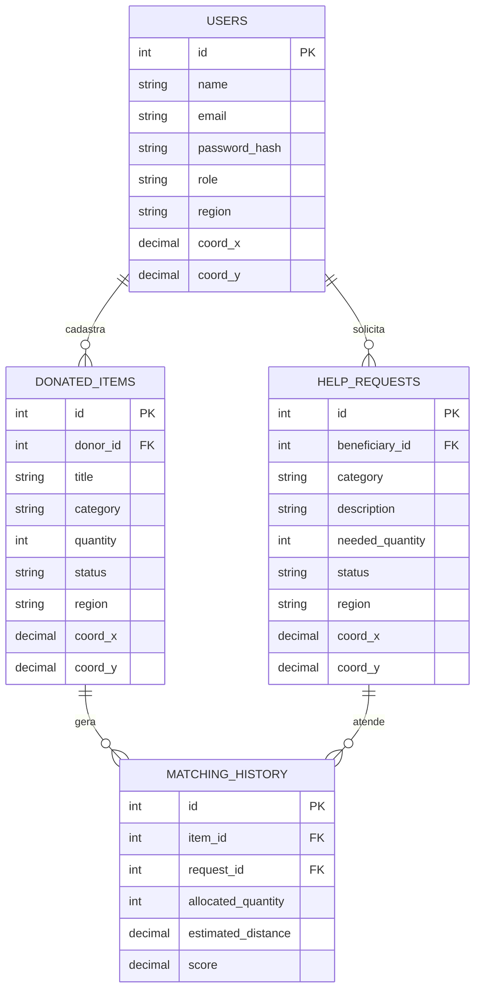

# MER - Modelo Entidade Relacionamento

```mermaid
erDiagram
    USERS ||--o{ DONATED_ITEMS : cadastra
    USERS ||--o{ HELP_REQUESTS : solicita
    DONATED_ITEMS ||--o{ MATCHING_HISTORY : gera
    HELP_REQUESTS ||--o{ MATCHING_HISTORY : atende

    USERS {
        int id PK
        string name
        string email
        string password_hash
        string role
        string region
        decimal coord_x
        decimal coord_y
    }

    DONATED_ITEMS {
        int id PK
        int donor_id FK
        string title
        string category
        int quantity
        string status
        string region
        decimal coord_x
        decimal coord_y
    }

    HELP_REQUESTS {
        int id PK
        int beneficiary_id FK
        string category
        string description
        int needed_quantity
        string status
        string region
        decimal coord_x
        decimal coord_y
    }

    MATCHING_HISTORY {
        int id PK
        int item_id FK
        int request_id FK
        int allocated_quantity
        decimal estimated_distance
        decimal score
    }
```

