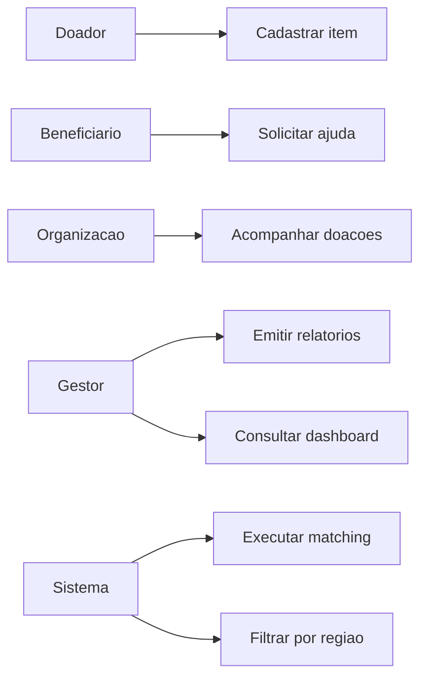

# UML - Casos de Uso

```mermaid
flowchart LR
    D["Doador"] --> A["Cadastrar item"]
    B["Beneficiario"] --> C["Solicitar ajuda"]
    O["Organizacao"] --> E["Acompanhar doacoes"]
    G["Gestor"] --> F["Emitir relatorios"]
    G --> H["Consultar dashboard"]
    S["Sistema"] --> I["Executar matching"]
    S --> J["Filtrar por regiao"]
```

