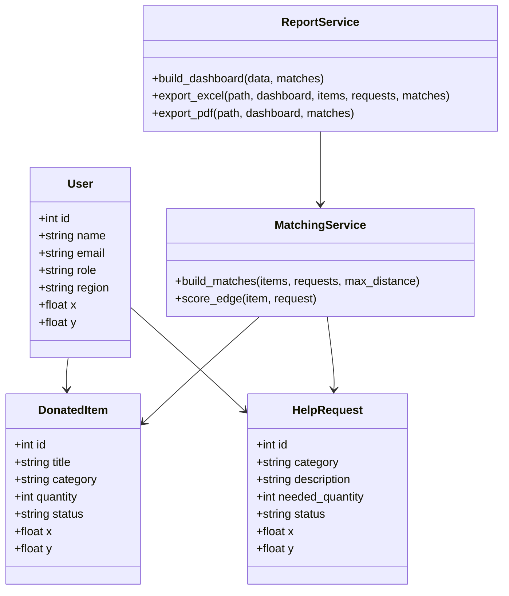

# UML - Visao de Classes

```mermaid
classDiagram
    class User {
        +int id
        +string name
        +string email
        +string role
        +string region
        +float x
        +float y
    }

    class DonatedItem {
        +int id
        +string title
        +string category
        +int quantity
        +string status
        +float x
        +float y
    }

    class HelpRequest {
        +int id
        +string category
        +string description
        +int needed_quantity
        +string status
        +float x
        +float y
    }

    class MatchingService {
        +build_matches(items, requests, max_distance)
        +score_edge(item, request)
    }

    class ReportService {
        +build_dashboard(data, matches)
        +export_excel(path, dashboard, items, requests, matches)
        +export_pdf(path, dashboard, matches)
    }

    User --> DonatedItem
    User --> HelpRequest
    MatchingService --> DonatedItem
    MatchingService --> HelpRequest
    ReportService --> MatchingService
```

